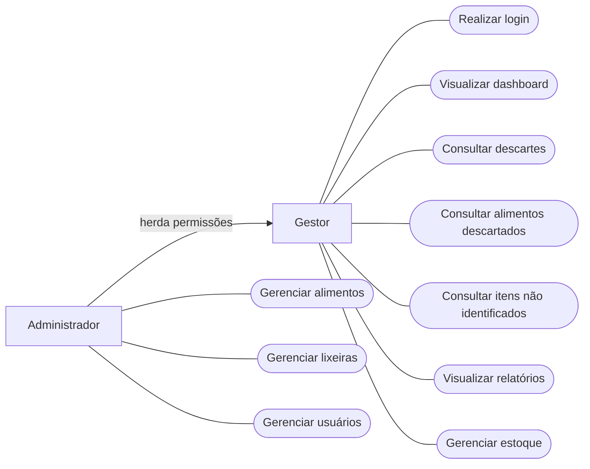

# Diagrama de Casos de Uso

O diagrama de casos de uso apresenta as principais funcionalidades do sistema **Lixeira Inteligente** e as interações dos diferentes tipos de usuários com a aplicação.

## Atores

### Gestor

O **Gestor** representa o usuário responsável pelo acompanhamento das informações do estabelecimento.

Principais funcionalidades:

- Realizar login;
- Visualizar o dashboard;
- Consultar descartes;
- Consultar alimentos descartados;
- Consultar itens não identificados;
- Visualizar relatórios;
- Gerenciar estoque.

### Administrador

O **Administrador** possui acesso às funcionalidades disponíveis ao Gestor e também às funções administrativas do sistema.

Além das funcionalidades herdadas do Gestor, poderá:

- Gerenciar alimentos;
- Gerenciar lixeiras;
- Gerenciar usuários.

## Relação entre os atores

O **Administrador herda as permissões do Gestor**, possuindo acesso às funcionalidades disponíveis ao Gestor e também às funcionalidades administrativas específicas.

## Diagrama

## Descrição dos Casos de Uso

| Caso de uso | Descrição |
|---|---|
| **Realizar login** | Permite que o usuário acesse o sistema utilizando suas credenciais. |
| **Visualizar dashboard** | Permite acompanhar indicadores e informações sobre o desperdício de alimentos. |
| **Consultar descartes** | Permite visualizar os registros de descartes realizados pelas lixeiras inteligentes. |
| **Consultar alimentos descartados** | Permite consultar quais alimentos foram identificados nos descartes. |
| **Consultar itens não identificados** | Permite visualizar os descartes que não puderam ser identificados pela IA. |
| **Visualizar relatórios** | Permite acompanhar relatórios e gráficos relacionados ao desperdício. |
| **Gerenciar estoque** | Permite acompanhar e gerenciar informações relacionadas ao estoque do estabelecimento. |
| **Gerenciar alimentos** | Permite cadastrar, alterar e administrar os alimentos utilizados pelo sistema. |
| **Gerenciar lixeiras** | Permite cadastrar e administrar as lixeiras inteligentes vinculadas ao estabelecimento. |
| **Gerenciar usuários** | Permite cadastrar e administrar os usuários que possuem acesso ao sistema. |
